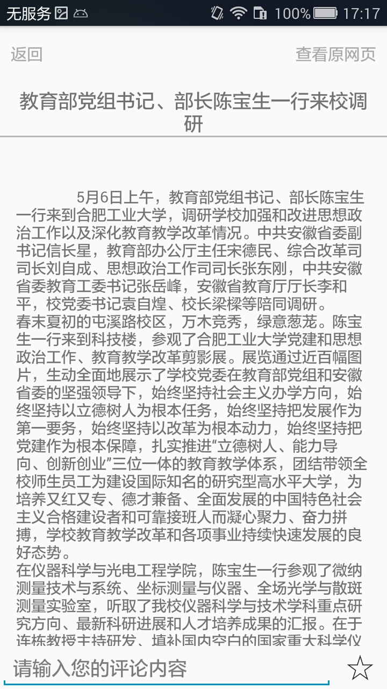
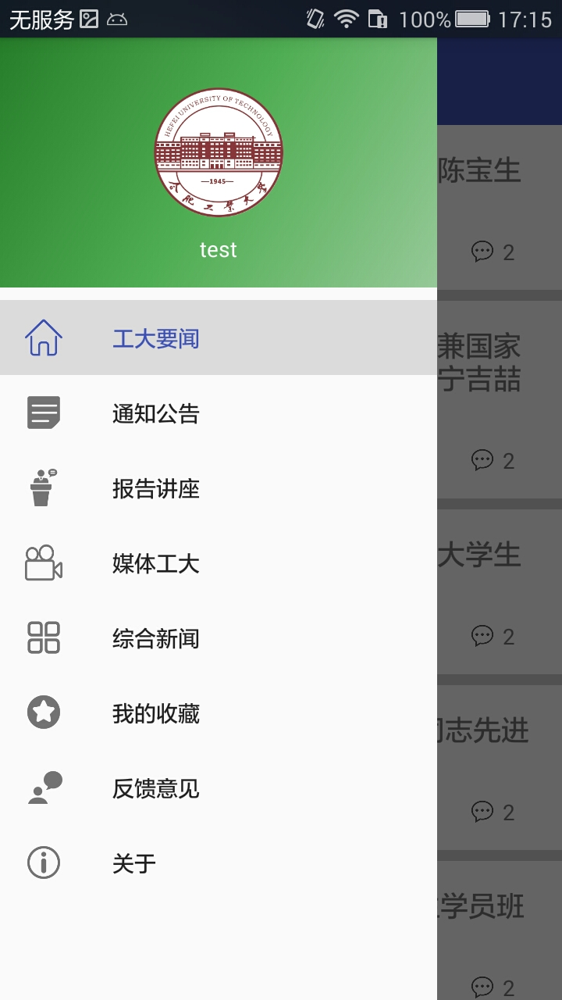

# HFUTNews
合肥工业大学校园新闻客户端

**HFUTNews**为android客户端源码，使用Android Studio编写导入。

***hfutNewsServer***为服务器端源码，使用IntelliJ IDEA编写。

***pachong***文件夹是爬虫端，用来爬取新闻数据源，使用PyCharm编写。

***数据库***文件夹是MySQL数据导出的可执行的sql语句的文件。

数据来源于合肥工业大学校园新闻官网，使用python爬虫爬取存储在mysql数据库中。
Android功能包括登录注册，新闻列表查看， 新闻收藏，新闻评论等功能。

界面截图：
登录界面：

主界面：

新闻详情界面：

侧滑展示界面：

